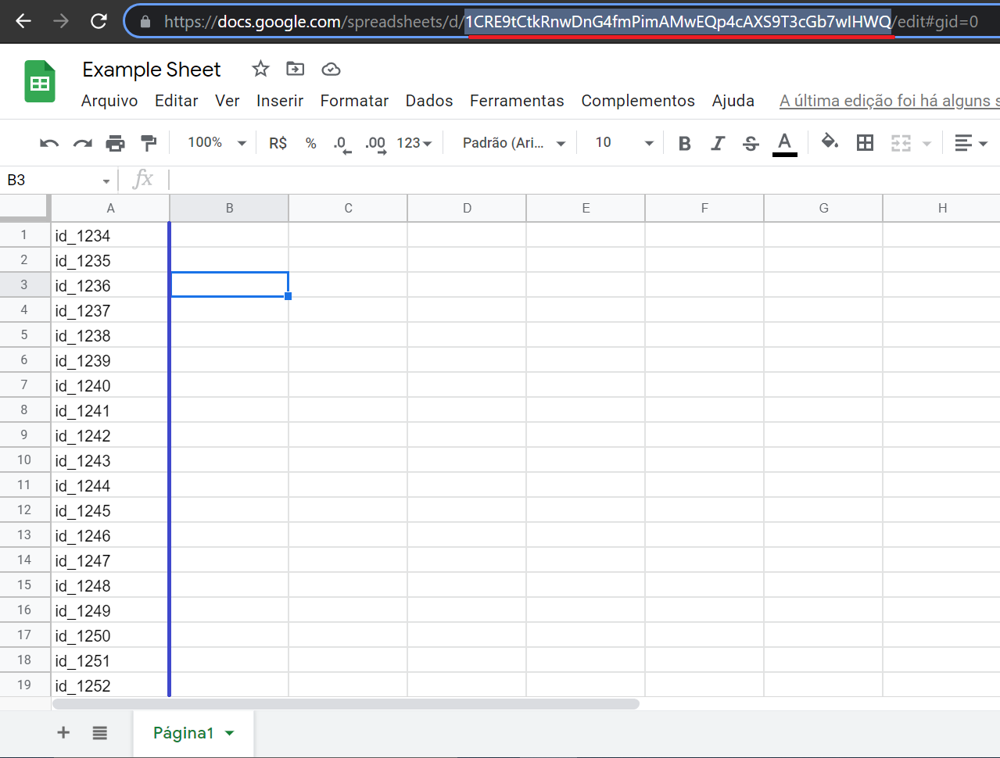

# auto-adder-skype
Auto adder skype using python, pyrobot, PySimpleGUI and Selenium

# Idea
The idea was create an automation who add everyone on my contacts automatically, cause add one by one was so repetitive and inefficient and this delays so much the process of implementation of new workers in the company.

# Thinking
So I knew it skype cab release a list of your contacts in csv at your website. With this list in csv, I dropped in google sheets and creat an api using console.cloud.google.com, who generates a json file with your credentials (I left one json file example).

# Implementation
I already have an api with all my contacts, so lets code, for this web scraping i have used selenium and was very efficient, but in button to add contact I used pyrobot (https://github.com/chriskiehl/pyrobot) to clicks, btw this code is actually working for 1440x900.

# Interface
It was my first experience using interface in python, and with PySimpleGUI was amazing, the code was very simple and intuitive.

 

# Functions
The automation have two functions. First add all contacts of your sheets using google api and key of your sheet. Second add new contact (in my case a new employee) to my sheet.

# Code
First sorry for by bad english, all the code and comments are in pt-br.

# Sheet
Example of sheet, in the red is the sheet key to input in your code and in the blue is a example of your list of ids.

# My experience
3 months using python to small projects and web scraping.

